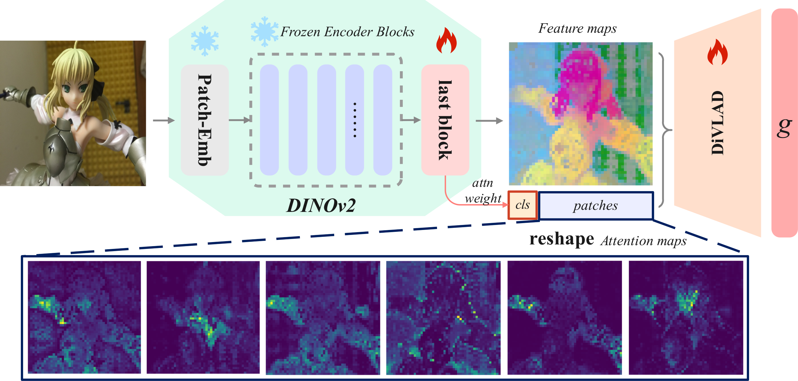

<div align="center">

# SupScene: Learning Overlap-Aware Global Descriptor for Unconstrained SfM

<em>Subgraph-based supervision + DiVLAD aggregation for overlap-aware retrieval</em>

</div>


<p align="center">
  <a href="https://dpcv.github.io/SupScene"></a>
  <a href="https://arxiv.org/abs/xxxx.xxxxx"></a>
  <a href="https://arxiv.org/abs/xxxx.xxxxx"></a>
  <a href="https://github.com/huggingface/accelerate"></a>
  <a href="https://opensource.org/licenses/Apache-2.0"></a>
  <a href="https://github.com/DPCV"></a>
</p>

> 🚀 **SupScene** learns global descriptors that favor **geometrically overlapping** image pairs for large-scale, unconstrained SfM—using **subgraph-based supervision** and a **DINO-inspired VLAD (DiVLAD)** aggregator with learnable gating.

---

## 🌟 Highlights (TL;DR)

* **Subgraph-based training** with **soft supervised contrastive loss** ➜ fine-grained, overlap-aware supervision
* **DiVLAD**: leverages **ViT last-block multi-head attention** + **learnable gating** for discriminative global descriptors
* **Plug-and-play**: strong retrieval gains with **negligible additional parameters** compare with NetVLAD, flexibly connecting to other aggregators.


## 🔬 Core innovations & DiVLAD design

Sources of inspiration
  - DINO / DINOv2 ViT: last-block multi-head attention maps reveal semantic and spatial focus useful as soft visual cues.
  - NetVLAD / VLAD: residual-centered aggregation is effective for pooling local features into discriminative global vectors. This is easy to extend.

<details>
<summary>Details about DiVLAD</summary>

Sources of inspiration
  - Code references
    - supscene/models/aggregator/divlad.py
    - third_party/dinov2/ (weights & loader helpers)

  - Papers (references)
    - NetVLAD — Arandjelovic et al., "NetVLAD: CNN architecture for weakly supervised place recognition", CVPR 2016. https://www.cv-foundation.org/openaccess/content_cvpr_2016/papers/Arandjelovic_NETVLAD_CNN_Architecture_CVPR_2016_paper.pdf
    - DINO / DINOv2 — see DINO and DINOv2 papers and official repos for ViT attention and weights (search "DINO self-distillation" and "DINOv2" for sources)

  Use the above code paths and papers as concise references for DiVLAD implementation and background.

</details>


## ⚙️ Installation

```bash
# 1) Create conda environment (example)
conda create -n supscene python=3.10 -y
conda activate supscene

# 2) Install project dependencies and install package
pip install -r requirements.txt

# 3) (Optional) DINOv2 dependencies and weights
# Place DINOv2 code/weights under third_party/dinov2 (project reads this path by default)
```

---

## 📦 Data Preparation

* **GL3D**: put the dataset under `data/GL3D/`
* *(Optional)* **1DSfM**: `data/1dsfm/`
* Generate splits / metadata:

```bash
python scripts/make_train_split.py \
  --data-root data/GL3D \
  --out-dir data/dataset_split/GL3D
```

> ✍️the detailed GL3D prep notes are shown as below.
```
GL3D
  ├── 5c2b3ed5e611832e8aed46bf
  │   ├── images
  │   ├── images.txt
  │   └── overlaps.npz
  ├── 5c34300a73a8df509add216d
  │   ├── images
  │   ├── images.txt
  │   └── overlaps.npz
  ├── 5c34529873a8df509ae57b58
  │   ├── images
  │   ├── images.txt
  │   └── overlaps.npz
  └── scenes.txt
```


## 🚀 Quick Start

**Train (DiVLAD on GL3D)**

```bash
python main.py \
  --config configs/divlad_default.yaml 
```

**Evaluate**

```bash
python main.py \
  --config configs/divlad_default.yaml \
  --eval_only True
```

---

<!-- ## 📈 Results (Placeholders)

| Dataset | Metric (R@1 / R@5 / mAP) | NetVLAD | SupScene (DiVLAD) |
| ------: | :----------------------- | :-----: | :---------------: |
|    GL3D | …                        |    …    |         …         |
|   1DSfM | …                        |    …    |         …         | -->


## 🔍 Visualization

* **Attention maps:** ```scripts/draw_dinov2_attnmap.ipynb``` 
* **Assignment heatmap:** ```scripts/draw_heatmap.ipynb```


## 🗺️ Roadmap

- [ ] Release pretrain weight for DiVLAD
- [ ] Complish visualization scripts notebook
- [ ] Publish paper to arxiv
- [ ] Complete SfM reconstruction scripts on 1DSfM


## 📚 Citation

If you find **SupScene** useful, please cite:

<!-- ```bibtex
@article{YourName2025SupScene,
  title   = {SupScene: Learning Overlap-Aware Global Descriptor for Unconstrained SfM},
  author  = {Your Name and Coauthors},
  journal = {arXiv preprint arXiv:xxxx.xxxxx},
  year    = {2025}
}
``` -->
---

## 🙏 Acknowledgements

* **DINOv2** for ViT backbones and attention maps (see `third_party/dinov2/`)
* Thanks **NetVLAD** as a strong baseline
* GL3D dataset maintainers and the broader SfM community

---

## 📫 Contact

* Maintainer: *(to be added)*
* Project page: *(to be added)*

---

<p align="center">
  Made with ❤️ for large-scale SfM retrieval — star ⭐ the repo if it helps!
</p>
