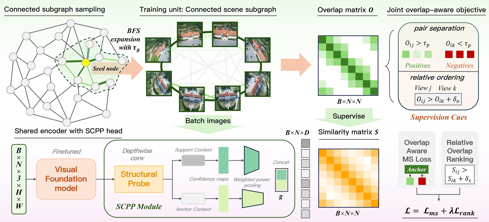
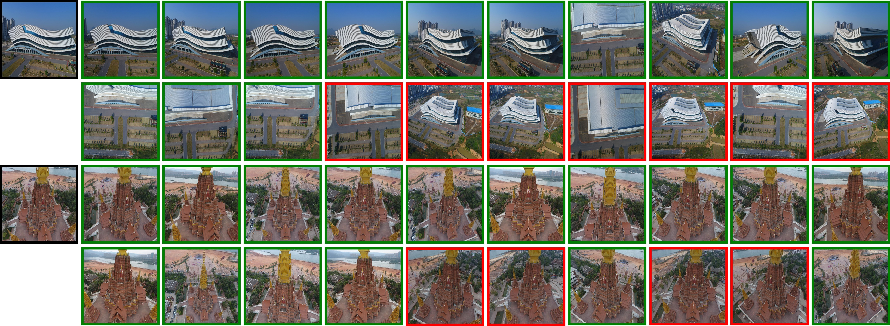

<div align="center">

# SupScene: Scene-Structured Overlap Supervision for Image Retrieval in Unconstrained SfM

<em>Scene-Structured supervision + SCPP aggregation for overlap-aware retrieval</em>

</div>


<p align="center">
  <a href="https://dpcv.github.io/SupScene"></a>
  <a href="https://arxiv.org/abs/xxxx.xxxxx"></a>
  <a href="https://arxiv.org/abs/xxxx.xxxxx"></a>
  <a href="https://github.com/huggingface/accelerate"></a>
  <a href="https://opensource.org/licenses/Apache-2.0"></a>
  <a href="https://dpcv.whu.edu.cn/"></a>
</p>

> 🚀 **SupScene** learns global descriptors that favor **geometrically overlapping** image pairs for large-scale, unconstrained SfM—using **Scene-Structured supervision** and **SCPP** aggregation.

---

## 🌟 Highlights (TL;DR)

- **Subgraph-based training** with **Overlap-aware joint loss**
- **SCPP** aggregation for structural representations

## 🔬 Core Design



- Backbone: DINOv2 (with optional LoRA/PEFT), ResNet
- Aggregator: SCPP / GeM / NetVLAD
- Loss: MultiSimilarityLoss + RankMarginLoss
- Metric: retrieval Recall / mAP / nDCG with global retrieval evaluation

## ⚙️ Installation

```bash
conda create -n supscene python=3.10 -y
conda activate supscene
pip install -r requirements.txt
```

## 📦 Data Preparation

Default data root in configs is `data`, with GL3D under `data/GL3D`.

Supported layout:

```text
data/GL3D/
  train/
    <scene_id>/
      images/
      images.txt
      gt.npz or overlaps.npz
  test/
    <scene_id>/
      images/
      images.txt
      gt.npz or overlaps.npz
```

Split-file mode is also supported:

```text
data/dataset_split/train.txt
data/dataset_split/val.txt
```

## 🚀 Quick Start

### Train

```bash
python main.py --config configs/peft-dinov2-scpp-lora.yaml

# ddp
accelerate launch main.py --config configs/peft-dinov2-scpp-lora.yaml
```

Other configs:

```bash
python main.py --config configs/scpp_default.yaml
python main.py --config configs/peft-dinov2-gem-lora.yaml
python main.py --config configs/netvlad_default.yaml
```

### Evaluate

```bash
python main.py --config configs/scpp_default.yaml --eval_only
```

From checkpoint:

```bash
python main.py --config configs/scpp_default.yaml --resume <checkpoint_path> --eval_only
```

Evaluate released pretrained weight:

```bash
python scripts/eval_pretrained_weight.py \
  --config configs/peft-dinov2-scpp-lora.yaml \
  --weights weights/dinov2_scpp_supscene_1536.pth \
  --whitening-dim 1536
```

## 🧰 Utility Scripts

- **Extract model/submodule weights**

```bash
python scripts/extract_model_weights.py \
  --ckpt experiments/peft-dinov2-scpp-lora/checkpoints/last \
  --out weights/supscene_model.pth
```

- **Extract features for whitening init**

```bash
python scripts/extract_features_for_init_whitening.py \
  --config configs/peft-dinov2-scpp-lora.yaml \
  --weights experiments/peft-dinov2-scpp-lora/checkpoints/last \
  --roots data/GL3D/train \
  --out-npy cache/features_for_whitening.npy
```

- **Assemble model with initialized whitening**

```bash
python scripts/assemble_whiten_model.py \
  --config configs/peft-dinov2-scpp-lora.yaml \
  --weights experiments/peft-dinov2-scpp-lora/checkpoints/last \
  --features cache/features_for_whitening.npy \
  --whitening-dim 1536 \
  --out weights/dinov2_scpp_supscene_1536.pth
```

## 🔌 Torch Hub

Use via Torch Hub (repo: `Suxilan/SupScene`):

```python
import torch

model = torch.hub.load(
  "Suxilan/SupScene",
    "dinov2_scpp_supscene_1536",
    pretrained=True,
)
```

## 🔍 Visualization

- Attention maps: `scripts/draw_dinov2_attnmap.ipynb`
- Assignment heatmap: `scripts/draw_heatmap.ipynb`
- PCA feature-map visualization: `notebooks/visualize_pca_feature_map.ipynb`

## Results



## 📚 Citation

If you find **SupScene** useful, please cite this repository and related papers.

 <!-- ```bibtex
@article{YourName2025SupScene,
  title   = {SupScene: Learning Overlap-Aware Global Descriptor for Unconstrained SfM},
  author  = {Your Name and Coauthors},
  journal = {arXiv preprint arXiv:xxxx.xxxxx},
  year    = {2025}
}
```  -->
---

## 🙏 Acknowledgements

- DINOv2 for ViT backbones and representations
- NetVLAD and place-recognition community
- GL3D dataset maintainers
